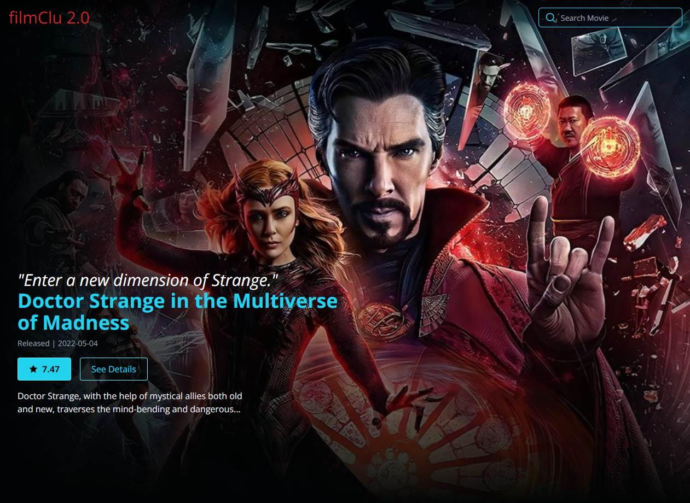

# filmClu 2.0
> Discover movies to watch!

[![Netlify][netlify-img]][netlify-url]
[![GitHub repo size][github-img]][github-url]
[![GitHub last commit][github-commit]][github-url]

<!-- Badges to Add: Netlify build, twitter, license? -->

_With filmClue 2.0, you can search for movies and check out their details. Each film page includes links to cast bio information, so you can learn all about your favorites. Built with the most excellent TMDB API._

Application Snapshot

### [Application Snapshot]()
<!-- 

  

 -->

 

## Features

- Movie search bar
- Carousel slider with film cards and Modal pop ups
- Supports **mouse** and **touch** events (tested via emulator. TODO: test live)
- Film detail pages with movie information and cast member links
- Cast member pages with bio and other films they are known for
- Infinite scrolling

### [Demo](https://filmclu-enjoy-movies.netlify.app/)

### Technology

  1. Nextjs
  2. Typescript
  3. TailwindCSS
  4. @Tanstack/React-Query
  5. Continuos Deployment on Netlify

## Getting Started

These instructions will get you a copy of the project up and running on your local machine for development and testing purposes. See deployment for notes on how to deploy the project on a live system.

### Installation

_Easily set up a local development environment_

 - clone or download zip file
 - cd into root
 - `npm install`
 - `npm run dev`

## Usage

Scroll and select a movie that interests you to see the details modal window. If you want more information, simply click the 'details' button to view the movie details page!

  

<!-- ## Meta

Your Name – [@YourTwitter](https://twitter.com/dbader_org) – YourEmail@example.com

Distributed under the XYZ license. See ``LICENSE`` for more information.

[https://github.com/yourname/github-link](https://github.com/dbader/) -->

## Additional Documentation and Acknowledgments

* [React Portals](https://reactjs.org/docs/portals.html) - for Modal
* [Baby Yoda](https://freepngimg.com/png/99068-cute-star-wars-photos-baby-yoda/download) from freepngimg.com
* [Kylo Ren](https://freepngimg.com/png/85568-star-kylo-character-darth-wars-fictional-ii) from freepngimg.com
* [Popcorn icon by Icons8](https://icons8.com/icons/set/popcorn)

## :books: Learning Resources

Infinite Scroll
   - [Load More Infinite Scroll](https://codesandbox.io/s/github/tannerlinsley/react-query/tree/1fc7ed08d18a5fbcc0c4c84525db5d02ff1cada2/examples/load-more-infinite-scroll?file=/hooks/useIntersectionObserver.js) by Tanner Linsley
   - [Infinite-Scroll](https://github.com/rara-record/infinite-scroll) by Rara-Record

NextJS
   - [Intermediate React with NextJS](https://www.youtube.com/watch?v=Tdp_S_72mSI) by Weibenfalk

## :memo: Notes

### 1. OnTouch Events
This is the first project where I have used onTouch events for mobile webapps. If you're new too, here are some notes that may assist you on your journey.

Useful resources: [React Long Press Event](https://stackoverflow.com/questions/48048957/react-long-press-event)

### 2. SerializableError: Error serializing
Found the isSerializable error a few times with this Nextjs project. A quick solution that worked for this use case was to add " || null" to return items in getStaticProps. Specifically for date format or number format objects.

For further reading on the subject see:
   - [getServerSideProps cannot be serialized as JSON. Please only return JSON serializable data types](https://github.com/vercel/next.js/issues/11993)
   - [Error: How to serialize data from getStaticProps : Next.js](https://stackoverflow.com/questions/66106776/error-how-to-serialize-data-from-getstaticprops-next-js)

<!-- Markdown link & img dfn's -->
[github-img]: https://img.shields.io/github/repo-size/lisawagner/filmdeets-nextjs-tailwind-ts?logo=github&style=flat-square
[github-url]: https://github.com/lisawagner/filmdeets-nextjs-tailwind-ts
[github-commit]: https://img.shields.io/github/last-commit/lisawagner/filmdeets-nextjs-tailwind-ts?logo=github&style=flat-square

[netlify-img]: https://img.shields.io/netlify/8f53362b-5385-445d-bff8-fbf44086fa13?style=flat-square
[netlify-url]: https://filmclu-enjoy-movies.netlify.app/